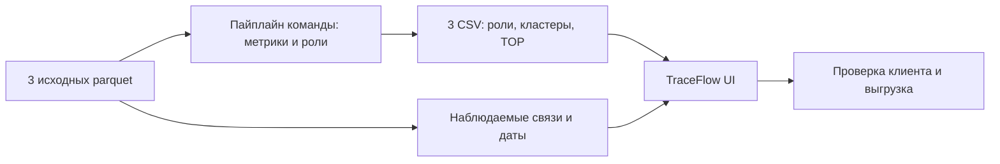

# TraceFlow — интерфейс исследования финансовой сети

Рабочее место аналитика для кейса HackAlem AI «Граф денег». Поиск клиента по GID,
направленные связи, объяснение роли из пайплайна, кластеры и очередь проверки.
UI работает локально, без CDN, внешних API и отправки данных в облако.

## Запуск UI

Python 3.12+. Установить зависимости в своём рабочем окружении:

```sh
python -m pip install -r requirements-ui.txt
```

Запуск из корня проекта:

```sh
python -m streamlit run ui/app.py
```

Открыть адрес, напечатанный Streamlit (обычно http://localhost:8501).
Если существующая `.venv` ссылается на удалённый Python, создайте новое окружение
`python -m venv .ui-runtime`, установите зависимости его интерпретатором и запускайте им UI.
Переносить готовую `.venv` между компьютерами не нужно.

## Подключение аналитики команды

По умолчанию UI читает исходные файлы из `data (1)/data/`, а результаты из `output/`:

| Файл | Обязательные колонки |
| --- | --- |
| `nodes_roles.csv` | `gid, role, role_score, cluster_id, priority_score, evidence` |
| `clusters.csv` | `cluster_id, n_nodes, n_seed, sum_kzt_internal, top_gids, hypothesis` |
| `top_nodes.csv` | `rank, gid, role, priority_score, why` |

Кодировка UTF-8 или UTF-8 BOM. GID сохраняется как строка при чтении CSV,
чтобы 18-значные идентификаторы не округлялись. Скоры должны лежать в [0, 1],
evidence — непустое объяснение до 200 символов. Дополнительные колонки разрешены.
По ТЗ нужны 2 248 клиентов и не менее 20 строк в очереди.

Связи читаются сначала из `output/edges.parquet` или `output/edges.csv`,
затем из исходного `edges.parquet`. Отдельные транзакции для временного графика
читаются из исходного `transactions.parquet`. Все файлы должны относиться к одному кейсу.
После замены файлов нажмите **Обновить данные**.

Другие пути задаются до запуска, например в PowerShell:

```powershell
$env:TRACEFLOW_RESULTS_DIR = "C:\path\to\results"
$env:TRACEFLOW_DATA_DIR = "C:\path\to\data"
python -m streamlit run ui/app.py
```

Три состояния интерфейса:

- **Исходные данные:** доступны все клиенты и переводы; роли, скоры и кластеры не выдумываются.
- **Результаты пайплайна:** карточки, evidence, кластеры, TOP-20 и скачивание переданных CSV.
- **Демо: mock CSV:** явно маркированный вымышленный пример. Автоматически открывается при полном отсутствии результатов; также включается вручную. Частичная или повреждённая выгрузка не подменяется mock.

## Что умеет UI

- Поиск любого GID, быстрый переход к TOP-20, переход из полной очереди и к контрагенту прямо под графом. Возврат к предыдущему GID.
- Схема входящих и исходящих связей: стрелки, подсветка ролей или кластеров,
  масштабирование и перетаскивание. До 10 соседей на странице, остальные доступны
  переключателем. Показанное и полное число связей подписаны.
- Фильтр входящих и исходящих связей; голубые входящие и оранжевые исходящие стрелки.
- Скачивание сводки по GID: переданные роль, приоритет, объяснения, все связи и оговорки seed/depth=4.
- Полная таблица связей с суммами и числом переводов, скачивание CSV.
- Дневные входящие/исходящие суммы и количества транзакций.
- Каталог всех клиентов с фильтрами по роли и кластеру.
- Подсказки о неполноте входящего потока seed и обрыве на 4-м колене.
- Проверка ключевых полей CSV, отсутствующих данных и некорректного поиска.

UI только отображает модель команды. Суммы и дневная динамика — агрегаты наблюдаемых
переводов, они не используются для присвоения ролей.

## Проверки

```sh
python -m unittest discover -s tests -v
```

Только UI: `python -m unittest discover -s tests -p test_ui.py -v`.
Проверяются GID int64, некорректные скоры, поиск, изолированный клиент, переход по связи,
возврат к предыдущему GID, фильтры направлений, сводка, разделение mock и реальных данных,
повреждённые связи, подключение CSV и сохранение переданного аналитикой порядка rank.
Полный набор тестов требует также зависимостей аналитики, включая NetworkX и SciPy.

## Сценарий демонстрации, 5 минут

[Минутный сценарий, три реальных GID и снимки интерфейса](docs/demo.md).

1. Команда запускает свой пайплайн и получает три CSV. Обновить UI, показать размер сети.
2. Открыть первого клиента из TOP-20. Объяснить роль по evidence и конкретным метрикам команды.
3. Показать направление денег, полную таблицу связей и перейти к контрагенту.
4. Показать кластер и дневные переводы. Отделить наблюдения от гипотез.
5. Найти произвольный GID жюри. Показать скачивание результатов и ограничения наблюдения.

Схема интеграции:



## Ограничения и готовность к сдаче

Аналитический пайплайн команды подключён через `output/`. UI показывает переданные
результаты без пересчёта ролей, оценок и порядка rank. Замечания к формату доступны
в боковой панели «Качество выгрузки». Найденные ограничения финальной интеграции
перечислены в [документе демо](docs/demo.md#замечания-для-финальной-интеграции).
Этот README описывает запуск UI; проверка качества аналитических правил принадлежит команде аналитики.

Данные ограничены июлем 2026, внутрибанковскими переводами от 5 000 ₸ и обходом
по исходящим до 4 колен. На границе графа отсутствие исходящих не доказывает удержание
денег; входящий поток seed неполон. Времени суток нет. Нет ground truth ролей.
Все роли и гипотезы подлежат проверке, не являются утверждением о виновности.

Для графа около 1 млн узлов потребуются серверная фильтрация и пагинация каталога,
индексы по GID и датам, загрузка только нужного окружения/кластера и предварительные
агрегаты. Текущий UI рассчитан на предоставленные 2 248 узлов и читает таблицы целиком.
