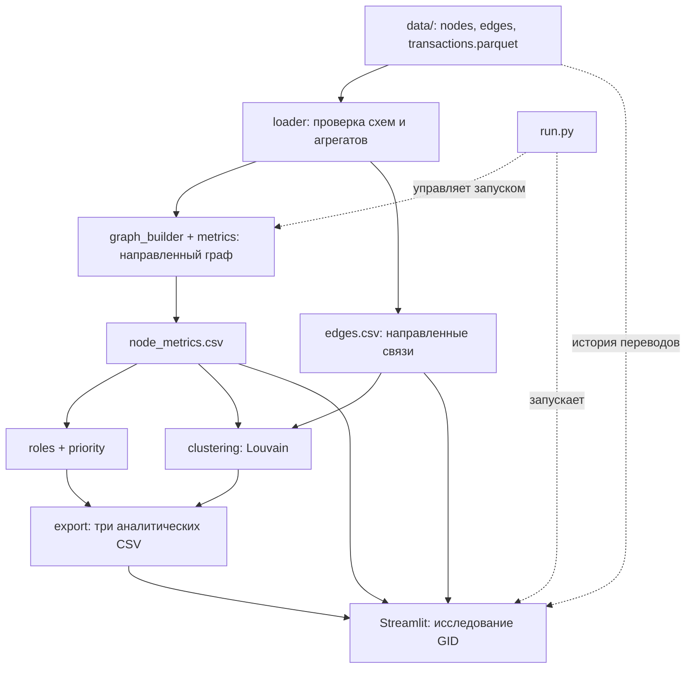
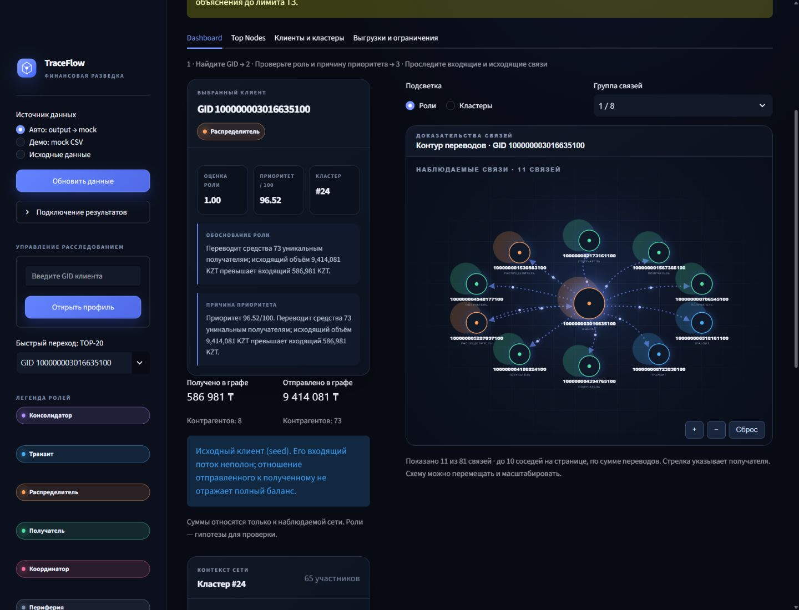
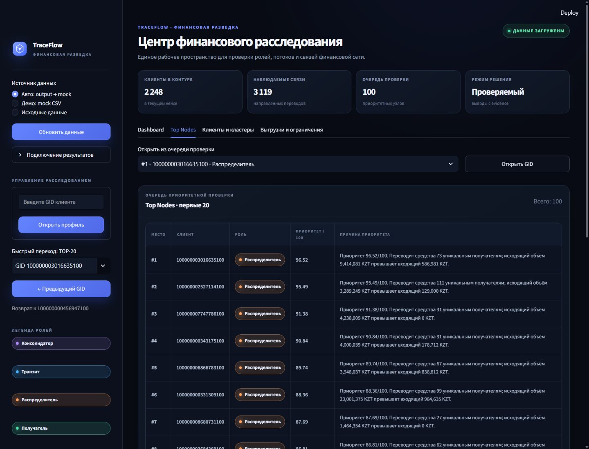

# TraceFlow — анализ графа денежных переводов

Прототип для кейса HackAlem AI «Граф денег». TraceFlow помогает аналитику исследовать транзакционную сеть: найти клиента, понять его предполагаемую роль, изучить движение средств и выбрать узлы для ручной проверки.

Роли, кластеры и приоритет — объяснимые гипотезы на основе наблюдаемых переводов. Они не являются доказательством нарушения или вероятностью виновности.

## Что реализовано

- Проверка трёх Parquet-файлов: узлы, направленные рёбра и транзакции. Сверяются суммы и число переводов по каждой паре, сохраняются длинные GID и изолированные узлы.
- Направленный граф NetworkX и метрики каждого GID: входящие и исходящие суммы, степени, число переводов, уникальные контрагенты, PageRank и betweenness.
- Шесть ролей по документированным правилам: `consolidator`, `transit`, `distributor`, `terminal`, `coordinator`, `peripheral`.
- `role_score` и `priority_score` в диапазоне **0–1**, обоснование `evidence` с конкретными числами длиной до **200 символов**.
- Louvain на взвешенной неориентированной проекции; исходные направления сохраняются в метриках и связях интерфейса.
- Три аналитических CSV фиксированной схемы, включая очередь из 20–100 узлов.
- Streamlit: поиск GID, карточка клиента, направленные связи, переход к контрагенту и возврат, TOP-20, каталог клиентов и кластеров, дневная история, скачивание отчётов и сводки по GID.
- Явно обозначенный синтетический mock-режим для демонстрации интерфейса.
- Общий запуск через `run.py` и автоматические проверки данных, аналитики, интеграции и UI.

## Как работает решение

1. Пользователь запускает `run.py` с исходными файлами в `data/`.
2. Pipeline проверяет данные, строит направленный граф и сохраняет метрики каждого GID.
3. Аналитика применяет правила ролей и приоритета, выделяет сообщества и сохраняет CSV в `output/`.
4. Открывается Streamlit. Аналитик выбирает клиента из TOP-20 или ищет GID, читает объяснение, изучает связи и кластер.
5. Для дальнейшей проверки можно скачать результаты и Markdown-сводку выбранного клиента.

Повторный аналитический расчёт может использовать готовый `node_metrics.csv`: исходный граф и метрики в этом режиме не пересчитываются.

## Технологии

| Назначение | Технология |
| --- | --- |
| Язык и целевая версия | Python 3.12.10 |
| Таблицы и Parquet | pandas, NumPy, PyArrow |
| Направленный граф, метрики, Louvain | NetworkX; SciPy для численных вычислений |
| Интерфейс | Streamlit, HTML/CSS и SVG связей |
| Проверки | `unittest`, Streamlit AppTest |
| AI-модели, API и внешние сервисы | Не подключены; анализ выполняется локальными алгоритмами |

Зависимости приложения перечислены в [requirements.txt](requirements.txt). Для запуска не нужны API-ключи или облачный аккаунт.

## Архитектура



| Компонент | Ответственность |
| --- | --- |
| `run.py` | Полный расчёт и запуск интерфейса одной командой |
| `src/loader.py` | Чтение и проверка Parquet |
| `src/graph_builder.py`, `src/metrics.py` | Направленный граф, метрики всех узлов |
| `src/roles.py`, `src/priority.py` | Правила, оценки и объяснения |
| `src/clustering.py` | Взвешенная проекция и сообщества Louvain |
| `src/export.py`, `src/pipeline.py` | Проверка результатов, CSV и последовательность расчёта |
| `ui/` | Чтение аналитики, поиск, карточки, граф, таблицы и скачивание |
| `data/`, `mock/` | Предоставленная выгрузка и отдельный синтетический пример |
| `tests/` | Проверки модулей, полного расчёта и UI |

UI не определяет роли и не пересчитывает аналитические оценки. Подробные правила — в [analytics.md](analytics.md), контракт между компонентами — в [docs/integration.md](docs/integration.md).

## Установка и запуск

Нужен Python **3.12.10**; целевая версия указана в `.python-version`. Установите её перед созданием окружения. Команды выполняются из корня репозитория.

### Получить код

```bash
git clone https://github.com/BAITC-Hacks/hack-c4e364b4-shakarim.git
cd hack-c4e364b4-shakarim
git switch analytics
```

Инструкция относится к интегрированной версии в ветке `analytics`.

### macOS / Linux

```bash
python3.12 --version
python3.12 -m venv .venv
.venv/bin/python -m pip install -r requirements.txt
.venv/bin/python run.py
```

### Windows PowerShell

```powershell
py -3.12 --version
py -3.12 -m venv .venv
.\.venv\Scripts\python.exe -m pip install -r requirements.txt
.\.venv\Scripts\python.exe run.py
```

Активация окружения не требуется: команды используют его интерпретатор напрямую. Проверка версии должна показать `3.12.10`; обозначение `3.12` в команде само по себе не устанавливает нужную patch-версию.

**После установки весь проект запускается одной командой `python run.py`** с Python из окружения. По умолчанию она читает `data/`, создаёт пять CSV и `analysis_context.json` в `output/`, затем открывает Streamlit на `http://localhost:8501`. Остановка — `Ctrl+C`.

Дополнительные режимы (далее `python` означает интерпретатор созданного окружения):

```bash
# Только расчёт и CSV
python run.py --analysis-only

# Готовые результаты; при их отсутствии UI показывает маркированный mock
python run.py --ui-only

# Другие папки и порт, без автоматического открытия браузера
python run.py --data data --output-dir output --port 8502 --headless

# Только аналитический этап по готовым метрикам и связям
python src/pipeline.py --input output/node_metrics.csv --edges output/edges.csv --output-dir output

# Отдельный полный pipeline без интерфейса
python src/pipeline.py --data data --output-dir output
```

Относительные пути аргументов разрешаются от корня проекта. `run.py` передаёт каталоги интерфейсу. При отдельном запуске `python -m streamlit run ui/app.py` можно задать переменные окружения `TRACEFLOW_DATA_DIR` и `TRACEFLOW_RESULTS_DIR`.

Режим `--input` сохраняет входные метрики и рёбра с каноническими именами колонок вместе с отчётами и контекстом запуска. Без `--edges` связи нельзя восстановить из агрегированных метрик: узлы получают отдельные кластеры, а `edges.csv` содержит только заголовок, заменяя старые связи. Для сетевых сообществ передайте рёбра того же набора данных. Подробности — в [контракте интеграции](docs/integration.md).

## Как проверить решение

Сценарий для жюри:

1. Установите зависимости и выполните `python run.py`.
2. В боковой панели выберите «Авто: output → mock». Источник должен быть «Готовые результаты пайплайна», а не синтетическое демо.
3. Найдите GID `100000003016635100` из приложенной выгрузки. Прочитайте роль, оценку, evidence и кластер; переключите входящие/исходящие связи.
4. Откройте Top Nodes, перейдите к клиенту, затем к связанному GID и вернитесь. Скачайте сводку по GID и аналитические CSV.
5. Найдите `100000000404740100` — узел на глубине 4 без исходящих связей; карточка должна объяснять границу наблюдения. Найдите `100000000456947100` — изолированный узел, который не должен исчезать из результатов.
6. При желании переключитесь на «Демо: mock CSV» и найдите `901245`. Значения в этом режиме синтетические.

Предоставленная выгрузка содержит **2 248 узлов, 3 119 направленных рёбер, 4 840 транзакций и 81 seed**. Полный запуск сохраняет все GID, включая 19 изолированных seed-узлов. В `top_nodes.csv` для этого набора формируется 100 строк; UI показывает первые 20 и позволяет переходить к остальным.

Автоматическая проверка:

```bash
python -m pip install -r requirements-test.txt
python -m unittest discover -s tests -v
```

Проверяются схемы, точность длинных GID, согласованность рёбер и транзакций, роли и ограничения наблюдения, диапазоны оценок, длина evidence, кластеризация, экспорт и UI. Интеграционные тесты используют временные каталоги. Число тестов и время запуска зависят от версии кода и окружения; актуальный результат выводит команда.

Подробный сценарий показа: [docs/demo.md](docs/demo.md).

## Данные и интеграции

Источник — локальная выгрузка внутрибанковских переводов за июль 2026 года: обход по исходящим переводам от 81 seed, глубина до четырёх колен, порог от 5 000 KZT. Это параметры предоставленного набора, а не универсальные ограничения загрузчика. [Описание датасета](docs/data-contract.md).

| Входной файл | Обязательные колонки |
| --- | --- |
| `data/nodes.parquet` | `gid, depth, is_seed` |
| `data/edges.parquet` | `src, dst, sum_kzt, n_tx, depth` |
| `data/transactions.parquet` | `src, dst, date, sum_kzt` |

Полный расчёт создаёт `node_metrics.csv`, `edges.csv` и три обязательных отчёта:

| Отчёт | Фиксированная схема колонок |
| --- | --- |
| `nodes_roles.csv` | `gid, role, role_score, cluster_id, priority_score, evidence` |
| `clusters.csv` | `cluster_id, n_nodes, n_seed, sum_kzt_internal, top_gids, hypothesis` |
| `top_nodes.csv` | `rank, gid, role, priority_score, why` |

GID исходных Parquet — `int64`; CSV и UI сохраняют идентификаторы без округления через `float` или JavaScript Number. Для поиска, ролей и связей UI достаточно пяти CSV одного запуска. Pipeline дополнительно создаёт `analysis_context.json`: режим расчёта, путь к источнику и контрольные суммы SHA-256.

Дневная история и дополнение метаданных из Parquet подключаются к готовым результатам только при совпадении контекста, исходных файлов и пяти CSV. После расчёта из CSV метрик либо без подтверждённого контекста исходная история не подключается: интерфейс сообщает об этом. После переноса исходных данных на другой путь повторите полный расчёт. Режим «Исходные данные» позволяет отдельно изучать Parquet без аналитических оценок.

Сгенерированные CSV и контекст `output/` исключены из Git и воспроизводятся командой запуска. Предоставленный набор `data/` и синтетический `mock/` хранятся в репозитории.

Приложение не отправляет транзакционные данные во внешние API. Обученная AI-модель, банковская интеграция и внешняя база данных в текущей версии отсутствуют.

## Ограничения

- Наблюдается один месяц внутрибанковских переводов выше порога. Переводы за другие периоды, вне банка и ниже порога не представлены.
- Входящий поток seed неполон, поэтому `pass_ratio` и совместимый `pass_through` для seed отсутствуют. Глубина 4 ограничивает дальнейшее наблюдение. Эти ограничения учитываются в правилах и пояснениях; отсутствие наблюдаемой связи не доказывает отсутствие реального перевода.
- `role_score` отражает силу эвристических признаков, `priority_score` — очередь ручной проверки. Размеченного эталона для измерения точности ролей нет; оценки не являются вероятностями.
- Louvain зависит от состава и весов сети. Seed алгоритма фиксирован для воспроизводимости; обновление данных или версий библиотек может изменить сообщества.
- PageRank и betweenness экспортируются как метрики; текущие правила ролей и приоритета не используют их напрямую.
- Для обязательного TOP-20 pipeline требует минимум 20 узлов. Mock служит демонстрации интерфейса и не заменяет анализ предоставленного набора.
- Данные и граф загружаются в память. Ниже 10 000 узлов betweenness рассчитывается полностью, от 10 000 — по выборке до 500 узлов. Работа на 1 млн узлов не подтверждена: понадобятся измерения памяти и времени, потоковая агрегация, серверное хранение и фильтрация, более масштабируемые графовые вычисления. Это план развития.
- Граф UI показывает до 10 соседей на странице; остальные доступны через переключатель. Сводка по GID включает все наблюдаемые связи клиента.
- Приложение предназначено для локальной демонстрации; многопользовательский доступ и авторизация не реализованы.

## Deployed-версия и материалы

Подтверждённой ссылки на опубликованную версию в репозитории нет. Для показа используйте локальный запуск `python run.py`.

Скриншоты показывают интерфейс; аналитические значения могут отличаться после пересчёта:




